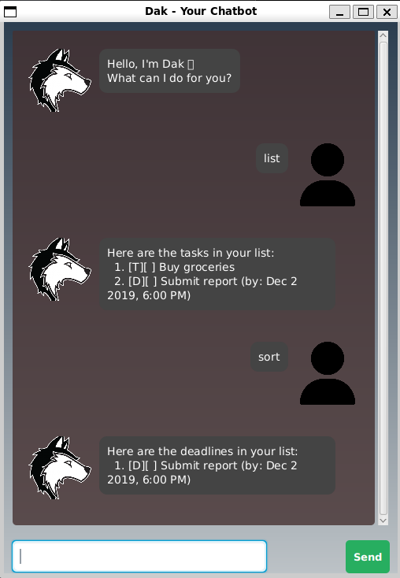

# **Dak User Guide**  

Welcome to **Dak!** Your personal AI-powered chatbot and task manager.  

  

---

## **Getting Started**  

1. **Download the `.jar` file** from the latest release.  
2. **Run Dak:**  
   ```bash
   java -jar dak.jar
   ```  

---

## **Features**  

### 🤖 **Chat with Dak**  
Dak responds to user commands through a chatbot interface.  

### ✅ **Task Management**  
Manage different types of tasks, including **todos, deadlines, events**.  

### 📜 **View Task List**  
Displays all currently stored tasks in an organized list.  

### ✏ **Modify Tasks**  
- **Mark tasks as done** or **unmark** them.  
- **Delete tasks** when they are no longer needed.  

### 🔍 **Search for Tasks**  
Find tasks quickly using keywords.  

### 📅 **Sort Deadlines**
Sorts all deadline tasks in chronological order based on their due date and display them.

### ❌ **Exit Dak**  
Close the chatbot when you're done.  

---

## **Usage**  

### **Adding a To-Do Task:** `todo`  
Adds a simple to-do task to your list.  

**Format:**  
```bash
 todo (DESCRIPTION)
```

**Example:**  
```bash
 todo Buy groceries
```

**Expected Outcome:**  
```
Got it. I've added this task:
  [T][ ] Buy groceries
Now you have 1 task in the list.
```

---

### **Adding a Deadline:** `deadline`  
Adds a task with a specific deadline.

**Format:**  
```bash
deadline (DESCRIPTION) /by (DATE_TIME)
```

**Examples:**  

- **Full date–time:**  
  ```bash
  deadline Submit report /by 2/12/2019 1800
  ```
- **Date only (defaults to midnight):**  
  ```bash
  deadline Submit report /by 2024-07-21
  ```

**Expected Outcome:**  
```
Got it. I've added this task:
  [D][ ] Submit report (by: Dec 2 2019, 6:00 PM)
Now you have 2 tasks in the list.
```

**Note:**  
- When providing a full date–time, use the format `d/M/yyyy HHmm` (e.g., `2/12/2019 1800`).
- If you only provide a date in ISO format (`yyyy-MM-dd`), the system will default the time to midnight.

---

### **Adding an Event:** `event`  
Adds an event that occurs within a specific time range.

**Format:**  
```bash
event (DESCRIPTION) /from (START_DATE_TIME) /to (END_DATE_TIME)
```

**Examples:**  

- **Full date–time:**  
  ```bash
  event Sprint planning /from 1/4/2025 0900 /to 16/4/2025 1700
  ```
- **Date only (defaults to midnight):**  
  ```bash
  event Sprint planning /from 2025-04-01 /to 2025-04-16
  ```

**Expected Outcome:**  
```
Got it. I've added this task:
  [E][ ] Sprint planning (from: Apr 1 2025, 9:00 AM to: Apr 16 2025, 5:00 PM)
Now you have 4 tasks in the list.
```

**Note:**  
- For full date–time input, use `d/M/yyyy HHmm` (e.g., `1/4/2025 0900` for 9:00 AM).
- If only a date is provided in ISO format (`yyyy-MM-dd`), the time will default to midnight.

---

### **Searching for Tasks:** `find`  
Find tasks that contain a keyword.  

**Format:**  
```bash
 find (KEYWORD)
```

**Example:**  
```bash
 find groceries
```

**Expected Outcome:**  
```
Here are the matching tasks in your list:
  1. [T][ ] Buy groceries
```

---

### **Marking a Task as Done:** `mark`  
Marks a task as completed.  

**Format:**  
```bash
 mark (INDEX)
```

**Example:**  
```bash
 mark 2
```

**Expected Outcome:**  
```
OK! I've marked this task as done:
  [D][X] Submit report (by: July 21 2024, 12:00 AM)
```

---

### **Unmarking a Task:** `unmark`  
Marks a task as not completed.  

**Format:**  
```bash
 unmark (INDEX)
```

**Example:**  
```bash
 unmark 2
```

**Expected Outcome:**  
```
OK! I've marked this task as not done yet:
  [D][ ] Submit report (by: July 21 2024, 12:00 AM)
```

---

### **Deleting a Task:** `delete`  
Deletes a task from the list.  

**Format:**  
```bash
 delete (INDEX)
```

**Example:**  
```bash
 delete 3
```

**Expected Outcome:**  
```
Noted. I've removed this task:
  [E][ ] Sprint planning (from: Apr 1 2025, 9:00 AM to: Apr 16 2025, 5:00 PM)
```

---

### **Listing All Tasks:** `list`  
Displays all current tasks.  

**Format:**  
```bash
 list
```

**Expected Outcome:**  
```
Here are the tasks in your list:
1. [T][ ] Buy groceries
2. [D][ ] Submit report (by: July 21 2024, 12:00 AM)
```

---

### **Sorting Deadlines:** `sort`  
Displays all deadline tasks sorted chronologically.

**Format:**  
```bash
sort
```

**Expected Outcome:**  
```
Here are the deadlines in your list:
  1. [D][ ] Submit report (by: July 21 2024, 12:00 AM)
```

---

### **Exiting the Application:** `bye`  
Closes the chatbot.  

**Format:**  
```bash
 bye
```
